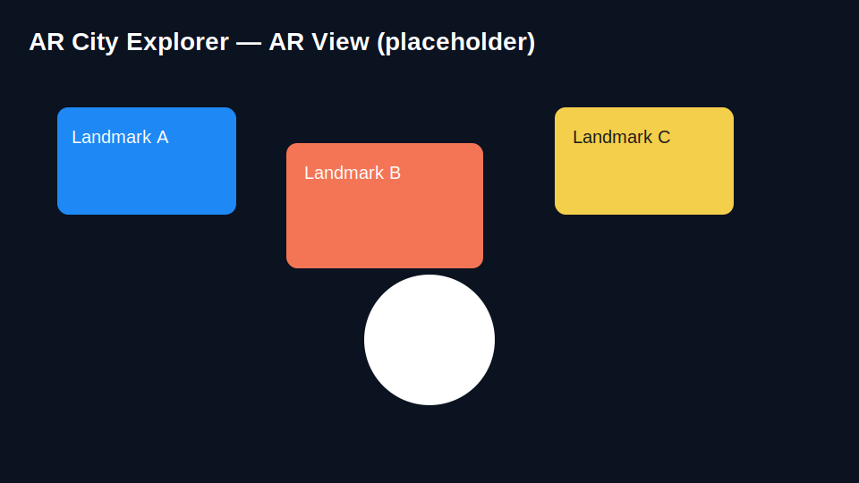
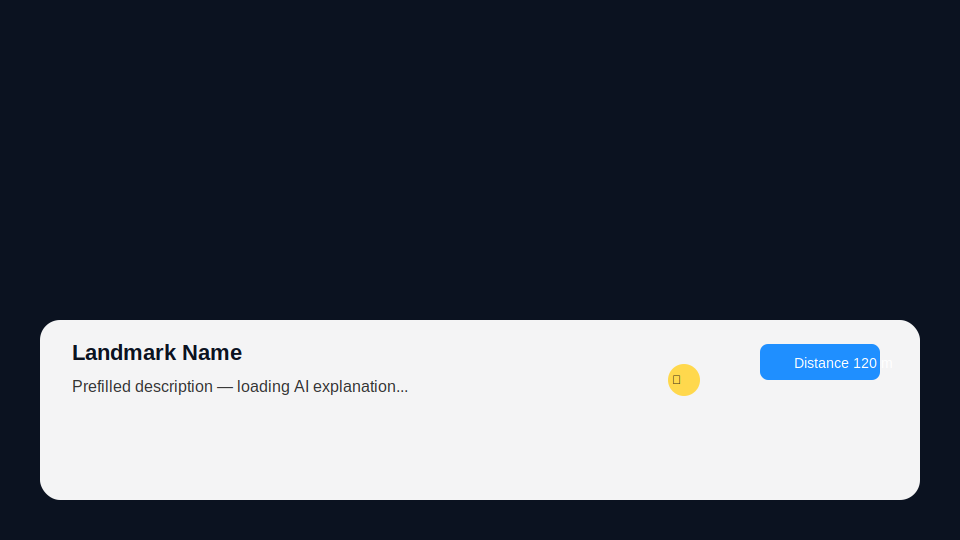
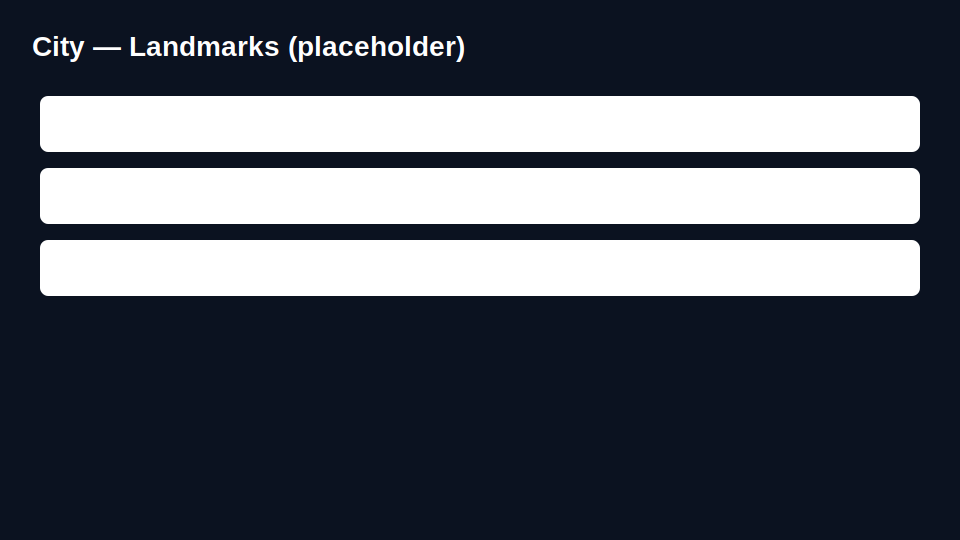

# AR City Explorer

 

Native AR city explorer — Angular + Capacitor + ARKit for landmark experiences.

This repo contains the Angular web app, a Capacitor plugin and an iOS app (Swift/ARKit) that renders landmarks in AR and forwards taps back to the web layer.

Quick start

- Install dependencies: `npm install`
- Start incremental web builds: `npm run dev:web`
- (Optional) Auto-copy web assets into the iOS project: `npm run dev:watch-copy`
- Fast deploy to a connected iOS device: `IOS_DEVICE_ID=<device-id> npm run fast:deploy`

Screenshots / demo

Below are sample screenshots (SVG placeholders). Replace these with real device screenshots or a short GIF to showcase the app.

AR view (card overlays):



Bottom sheet (prefill + AI loading):



City / landmark list:



How to add your real screenshots

1. Take screenshots on your device (iPhone): open the AR view and take screenshots of the AR overlay and the bottom sheet.
2. Add files to `docs/screenshots/` ideally named `ar-view.png`, `bottom-sheet.png`, and `list-view.png`.
3. Commit and push the images and update this README if you want to swap the placeholders.

Development notes

- Main native AR files: `ios/App/ARViewController.swift`, `ios/App/ARCityPlugin.swift`
- Web integration and listeners: `src/app/services/ar.service.ts` and `src/app/app.ts`
- Fast iteration helpers and docs: `scripts/fast-deploy.sh`, `docs/DEV_FAST_ITERATION.md`

License

This project is licensed under the MIT License (see `LICENSE`).
# ArCityExplorer

This project was generated using [Angular CLI](https://github.com/angular/angular-cli) version 21.0.2.

## Development server

To start a local development server, run:

```bash
ng serve
```

Once the server is running, open your browser and navigate to `http://localhost:4200/`. The application will automatically reload whenever you modify any of the source files.

## Code scaffolding

Angular CLI includes powerful code scaffolding tools. To generate a new component, run:

```bash
ng generate component component-name
```

For a complete list of available schematics (such as `components`, `directives`, or `pipes`), run:

```bash
ng generate --help
```

## Building

To build the project run:

```bash
ng build
```

This will compile your project and store the build artifacts in the `dist/` directory. By default, the production build optimizes your application for performance and speed.

## Running unit tests

To execute unit tests with the [Vitest](https://vitest.dev/) test runner, use the following command:

```bash
ng test
```

## Running end-to-end tests

For end-to-end (e2e) testing, run:

```bash
ng e2e
```

Angular CLI does not come with an end-to-end testing framework by default. You can choose one that suits your needs.

## Additional Resources

For more information on using the Angular CLI, including detailed command references, visit the [Angular CLI Overview and Command Reference](https://angular.dev/tools/cli) page.
